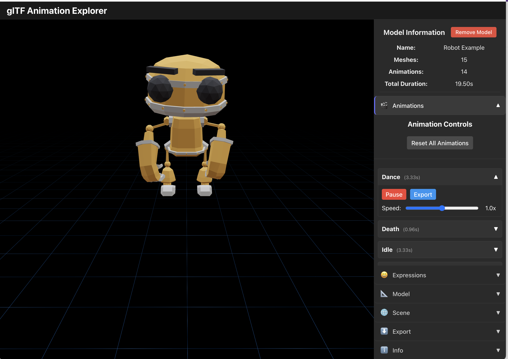

# glTF Animation Explorer

A powerful tool for exploring and testing animated glTF models for game development. Built with React, TypeScript, and React Three Fiber.



## Features

- **Model Loading**: Drag and drop glTF (.gltf or .glb) files to load them into the viewer
- **Animation Playback**: Play, pause, and adjust the speed of animations
- **Facial Expressions**: Control morph targets/blend shapes for models that support them
- **Model Transformation**: Adjust position, rotation, and scale of the model for better viewing
- **Scene Settings**: Toggle grid and axes visibility, change background color
- **Code Export**: Generate clean, structured React Three Fiber code for quick implementation in your projects
- **Dark Theme UI**: Sleek dark-themed interface for better visualization

## Use Cases

- Test animations for your game models before implementation
- Discover and explore all available animations and expressions in your models
- Visualize how different animations and expressions work together
- Generate ready-to-use code structures for implementing models in React Three Fiber projects
- Quickly prototype and debug animation implementations

## Getting Started

### Prerequisites

- Node.js 16+ and npm

### Installation

```bash
# Clone the repository
git clone https://github.com/dannyshmueli/glTF-explorer.git

# Navigate to the project directory
cd glTF-explorer

# Install dependencies
npm install

# Start the development server
npm run dev
```

## Usage

1. Launch the application using `npm run dev`
2. Either drag and drop a glTF/GLB file or use the example models
3. Use the sidebar controls to explore different aspects of your model:
   - **Animations**: Play, pause, and adjust animation speeds
   - **Expressions**: Control facial expressions or other morph targets
   - **Model**: Adjust viewing position, rotation, and scale
   - **Scene**: Configure lighting and background settings
   - **Info**: Learn more about how to use the explorer
   - **Export**: Generate clean React Three Fiber code for your model

## Export Feature

The export functionality generates well-structured code for React Three Fiber applications:

- **Model Data Structure**: Generates TypeScript interfaces or JavaScript objects with:
  - Properly named animation constants/enums
  - Animation durations and metadata
  - Available morph targets for expressions
  
- **Component Code**: Creates a reusable React component that:
  - Loads the model with proper imports
  - Sets up animation references
  - Provides commented examples of how to play animations
  - Shows how to set morph targets/expressions

The exported code focuses on providing clean structures for developers rather than preserving specific view settings from the explorer, making it ideal for easy integration into your projects.

## Built With

- **React**: UI framework
- **TypeScript**: Type-safe JavaScript
- **Vite**: Build tool and development server
- **Three.js**: 3D rendering library
- **React Three Fiber**: React renderer for Three.js
- **drei**: Useful helpers for React Three Fiber
- **Zustand**: State management

## License

This project is licensed under the MIT License - see the LICENSE file for details.

## Acknowledgments

- [Three.js](https://threejs.org) for the example models
- The "Robot Expressive" model by [Tomás Laulhé](https://www.patreon.com/quaternius) 
- [React Three Fiber](https://github.com/pmndrs/react-three-fiber) for their excellent documentation
